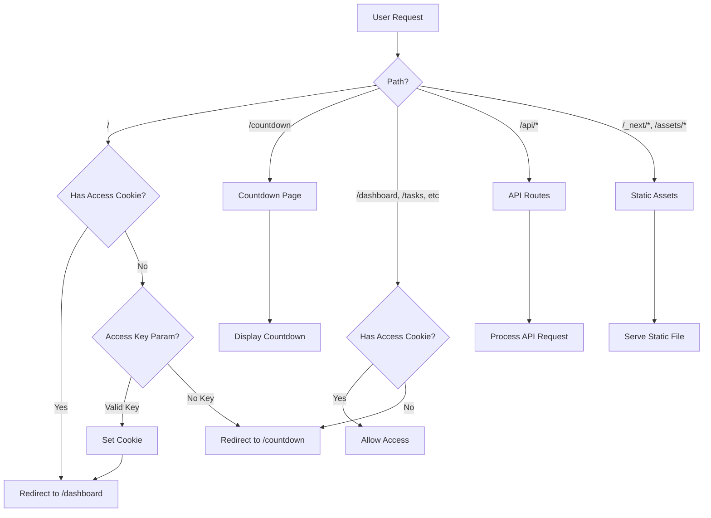

# Design Document

## Overview

This design addresses the 404 error occurring on Vercel and GitHub deployments by ensuring proper routing configuration, middleware setup, and deployment optimization. The solution maintains the existing countdown page functionality while fixing deployment issues and ensuring consistent behavior across environments.

### Current State Analysis

**Existing Implementation:**
- Countdown page exists at `app/countdown/page.tsx` as a Next.js client component
- Middleware at `middleware.ts` handles routing and access control
- Admin access system uses cookie-based authentication with secret key
- Static HTML file at `public/countdown.html` (legacy, not used)

**Identified Issues:**
1. Middleware configuration may be interfering with countdown page access
2. Deployment configuration might not be optimized for Vercel
3. Potential redirect loops between root and countdown routes
4. Missing or incorrect environment variable handling in production
5. Static asset serving configuration may need adjustment

## Architecture

### High-Level Flow



### Component Architecture

```
┌─────────────────────────────────────────┐
│         Next.js Application             │
├─────────────────────────────────────────┤
│                                         │
│  ┌───────────────────────────────────┐ │
│  │        Middleware Layer           │ │
│  │  - Route Protection               │ │
│  │  - Access Control                 │ │
│  │  - Cookie Management              │ │
│  └───────────────────────────────────┘ │
│                                         │
│  ┌───────────────────────────────────┐ │
│  │         Page Routes               │ │
│  │  - / (root)                       │ │
│  │  - /countdown                     │ │
│  │  - /dashboard                     │ │
│  │  - /tasks                         │ │
│  │  - /profile                       │ │
│  └───────────────────────────────────┘ │
│                                         │
│  ┌───────────────────────────────────┐ │
│  │         API Routes                │ │
│  │  - /api/auth/*                    │ │
│  │  - /api/stats/*                   │ │
│  │  - /api/tasks/*                   │ │
│  └───────────────────────────────────┘ │
│                                         │
│  ┌───────────────────────────────────┐ │
│  │       Static Assets               │ │
│  │  - /assets/*                      │ │
│  │  - /images/*                      │ │
│  │  - /_next/*                       │ │
│  └───────────────────────────────────┘ │
│                                         │
└─────────────────────────────────────────┘
```

## Components and Interfaces

### 1. Middleware Configuration

**File:** `middleware.ts`

**Purpose:** Control routing and access based on authentication state

**Key Functions:**
- Validate access keys from URL parameters
- Manage authentication cookies
- Redirect unauthenticated users to countdown
- Allow authenticated users to access protected routes
- Exclude static assets and API routes from processing

**Configuration:**
```typescript
interface MiddlewareConfig {
  matcher: string[];  // Paths to process
  excludePatterns: string[];  // Paths to exclude
}

interface AccessControl {
  secretKey: string;  // From environment variable
  cookieName: string;  // 'sylvan_test_access'
  cookieMaxAge: number;  // 7 days in seconds
  cookieOptions: {
    httpOnly: boolean;
    secure: boolean;
    sameSite: 'lax' | 'strict' | 'none';
    path: string;
  };
}
```

**Routing Logic:**
1. Check if path is `/countdown` → Allow access
2. Check if path is `/` → Check for access key or cookie
   - If access key valid → Set cookie, redirect to `/dashboard`
   - If cookie exists → Redirect to `/dashboard`
   - Otherwise → Redirect to `/countdown`
3. Check if path is protected route → Check for cookie
   - If cookie exists → Allow access
   - Otherwise → Redirect to `/countdown`
4. All other paths → Continue normally

### 2. Countdown Page Component

**File:** `app/countdown/page.tsx`

**Purpose:** Display countdown timer to public users

**Features:**
- Client-side countdown timer
- Responsive design
- Sylvan Token branding
- Smooth animations
- "We are live!" message when countdown ends

**State Management:**
```typescript
interface CountdownState {
  days: number;
  hours: number;
  minutes: number;
  seconds: number;
  isLive: boolean;
}
```

**Timer Logic:**
- Target date: November 15, 2025, 20:00 UTC
- Update interval: 1 second
- Calculate remaining time using Date objects
- Format numbers with leading zeros

### 3. Deployment Configuration

**Files:** `vercel.json`, `next.config.js`, `.vercelignore`

**Purpose:** Optimize deployment for Vercel platform

**Vercel Configuration:**
```json
{
  "buildCommand": "prisma generate && prisma migrate deploy && next build",
  "framework": "nextjs",
  "regions": ["iad1"],
  "env": {
    "DATABASE_URL": "@database_url",
    "NEXTAUTH_URL": "@nextauth_url",
    "NEXTAUTH_SECRET": "@nextauth_secret",
    "TEST_ACCESS_KEY": "@test_access_key"
  }
}
```

**Next.js Configuration:**
- Enable React strict mode
- Disable powered-by header
- Enable compression
- Configure image optimization
- Set up caching headers
- Optimize package imports

**Headers Configuration:**
```typescript
interface HeaderConfig {
  source: string;
  headers: Array<{
    key: string;
    value: string;
  }>;
}
```

**Required Headers:**
1. Security headers (all routes)
   - X-Content-Type-Options: nosniff
   - X-Frame-Options: SAMEORIGIN
   - X-XSS-Protection: 1; mode=block
   - Referrer-Policy: strict-origin-when-cross-origin

2. Cache headers (static assets)
   - Cache-Control: public, max-age=31536000, immutable

3. API headers (API routes)
   - Cache-Control: no-store, must-revalidate

### 4. Environment Variables

**Required Variables:**

**Development (.env.local):**
```
TEST_ACCESS_KEY=07c3bc6110ce1528fa7206f504420d3fc62deab8a8ea03548d289b6eb8a3fc1c
NEXTAUTH_URL=http://localhost:3333
NEXTAUTH_SECRET=<development-secret>
DATABASE_URL=<database-connection-string>
```

**Production (Vercel Environment Variables):**
```
TEST_ACCESS_KEY=<production-secret-key>
NEXTAUTH_URL=https://your-domain.vercel.app
NEXTAUTH_SECRET=<production-secret>
DATABASE_URL=<production-database-url>
```

**Validation:**
- Check for required variables at build time
- Provide default fallback for TEST_ACCESS_KEY in middleware
- Log warnings for missing variables in development
- Fail build for missing critical variables in production

## Data Models

No database schema changes required. This feature only affects routing and configuration.

## Error Handling

### 1. Middleware Errors

**Scenario:** Middleware processing fails
**Handling:**
- Log error details with request path and headers
- Allow request to continue (fail open for availability)
- Return 500 error page if critical failure

**Implementation:**
```typescript
try {
  // Middleware logic
} catch (error) {
  console.error('Middleware error:', {
    path: request.nextUrl.pathname,
    error: error.message,
    stack: error.stack
  });
  return NextResponse.next(); // Fail open
}
```

### 2. Missing Environment Variables

**Scenario:** TEST_ACCESS_KEY not set
**Handling:**
- Use hardcoded fallback in development
- Log warning message
- In production, use environment variable or fail build

**Implementation:**
```typescript
const SECRET_ACCESS_KEY = process.env.TEST_ACCESS_KEY || 
  (process.env.NODE_ENV === 'development' 
    ? '07c3bc6110ce1528fa7206f504420d3fc62deab8a8ea03548d289b6eb8a3fc1c'
    : null);

if (!SECRET_ACCESS_KEY && process.env.NODE_ENV === 'production') {
  throw new Error('TEST_ACCESS_KEY must be set in production');
}
```

### 3. Redirect Loops

**Scenario:** Infinite redirects between routes
**Handling:**
- Add redirect count tracking
- Break loop after 3 redirects
- Log warning and serve error page

**Prevention:**
- Ensure countdown route is excluded from middleware
- Verify cookie is properly set before redirecting
- Test all redirect paths thoroughly

### 4. 404 Errors

**Scenario:** Page not found
**Handling:**
- Log requested path and referrer
- Check if path should be handled by middleware
- Serve custom 404 page with link to countdown

**Monitoring:**
- Track 404 errors in production
- Alert if 404 rate exceeds threshold
- Review logs to identify missing routes

### 5. Build Failures

**Scenario:** Deployment build fails
**Handling:**
- Validate configuration before build
- Check for syntax errors in config files
- Verify all dependencies are installed
- Test build locally before deploying

**Validation Script:**
```bash
#!/bin/bash
# Pre-deployment validation
npm run lint
npm run build
npm run test:unit
```

## Testing Strategy

### 1. Unit Tests

**Middleware Logic:**
- Test access key validation
- Test cookie setting and reading
- Test redirect logic for each route
- Test exclusion patterns

**Countdown Component:**
- Test countdown calculation
- Test timer updates
- Test "live" state transition
- Test responsive rendering

### 2. Integration Tests

**Routing Flow:**
- Test unauthenticated user flow (/ → /countdown)
- Test authenticated user flow (/?access=KEY → /dashboard)
- Test protected route access with/without cookie
- Test static asset serving

**Environment Variables:**
- Test with missing variables
- Test with invalid variables
- Test with production-like configuration

### 3. End-to-End Tests

**User Scenarios:**
1. New user visits site → sees countdown
2. Admin uses access key → accesses dashboard
3. Admin returns with cookie → accesses dashboard
4. Cookie expires → redirected to countdown
5. Direct countdown access → works without auth

**Deployment Tests:**
1. Deploy to Vercel staging
2. Test all routes
3. Verify environment variables
4. Check error logs
5. Promote to production

### 4. Manual Testing Checklist

**Local Environment:**
- [ ] Start dev server
- [ ] Visit http://localhost:3333
- [ ] Verify redirect to /countdown
- [ ] Visit http://localhost:3333/?access=KEY
- [ ] Verify redirect to /dashboard
- [ ] Clear cookies and verify redirect to /countdown
- [ ] Test all protected routes

**Production Environment:**
- [ ] Deploy to Vercel
- [ ] Visit production URL
- [ ] Verify countdown page loads
- [ ] Test access key flow
- [ ] Test cookie persistence
- [ ] Test on mobile device
- [ ] Test in different browsers
- [ ] Check Vercel logs for errors

### 5. Performance Testing

**Metrics to Monitor:**
- Page load time for countdown
- Time to first byte (TTFB)
- Middleware processing time
- Redirect latency
- Static asset caching effectiveness

**Tools:**
- Lighthouse for performance audit
- Vercel Analytics for real-user monitoring
- Chrome DevTools for network analysis

## Deployment Process

### 1. Pre-Deployment Checklist

- [ ] All tests passing
- [ ] Environment variables configured in Vercel
- [ ] Build succeeds locally
- [ ] No console errors in development
- [ ] Middleware logic reviewed
- [ ] Countdown page tested
- [ ] Access key flow tested

### 2. Deployment Steps

```bash
# 1. Ensure all changes are committed
git status

# 2. Run tests
npm run test:unit
npm run lint

# 3. Build locally to verify
npm run build

# 4. Commit changes
git add .
git commit -m "fix: Resolve countdown 404 error and optimize deployment"

# 5. Push to GitHub
git push origin main

# 6. Vercel auto-deploys from main branch
# Monitor deployment at https://vercel.com/dashboard
```

### 3. Post-Deployment Verification

```bash
# Test countdown page
curl -I https://your-domain.vercel.app/countdown

# Test root redirect
curl -I https://your-domain.vercel.app/

# Test access key flow
curl -I "https://your-domain.vercel.app/?access=YOUR_KEY"

# Check Vercel logs
vercel logs
```

### 4. Rollback Plan

If deployment fails:
1. Identify the issue from Vercel logs
2. Revert to previous deployment in Vercel dashboard
3. Fix issues locally
4. Test thoroughly
5. Redeploy

## Configuration Files Summary

### middleware.ts
- Exclude `/countdown` from matcher
- Validate access keys
- Manage cookies
- Handle redirects

### next.config.js
- Configure headers
- Optimize images
- Enable compression
- Set up caching

### vercel.json
- Define build command
- Set environment variables
- Configure regions
- Set function timeouts

### .vercelignore
- Exclude test files
- Exclude documentation
- Exclude development files
- Keep necessary build files

## Security Considerations

1. **Access Key Protection:**
   - Store in environment variables
   - Never commit to repository
   - Use different keys for dev/prod
   - Rotate keys periodically

2. **Cookie Security:**
   - HTTP-only flag enabled
   - Secure flag in production
   - SameSite=lax for CSRF protection
   - 7-day expiration

3. **Headers:**
   - X-Frame-Options prevents clickjacking
   - X-Content-Type-Options prevents MIME sniffing
   - Referrer-Policy limits information leakage

4. **Environment Variables:**
   - Validate at build time
   - Never expose in client code
   - Use Vercel's encrypted storage

## Performance Optimizations

1. **Caching Strategy:**
   - Static assets: 1 year cache
   - Countdown page: No cache (dynamic)
   - API routes: No cache
   - Images: Optimized with Next.js Image

2. **Code Splitting:**
   - Lazy load non-critical components
   - Dynamic imports for heavy libraries
   - Optimize bundle size

3. **Middleware Efficiency:**
   - Minimize processing time
   - Early returns for excluded paths
   - Efficient regex patterns

4. **Build Optimization:**
   - Remove console logs in production
   - Minify JavaScript and CSS
   - Optimize images
   - Tree-shake unused code

## Monitoring and Logging

1. **Error Tracking:**
   - Log all middleware errors
   - Track 404 errors
   - Monitor redirect loops
   - Alert on high error rates

2. **Performance Monitoring:**
   - Track page load times
   - Monitor TTFB
   - Measure middleware latency
   - Track Core Web Vitals

3. **User Analytics:**
   - Count countdown page views
   - Track access key usage
   - Monitor user flow
   - Identify drop-off points

4. **Deployment Monitoring:**
   - Watch build times
   - Track deployment success rate
   - Monitor function execution
   - Check for cold starts
