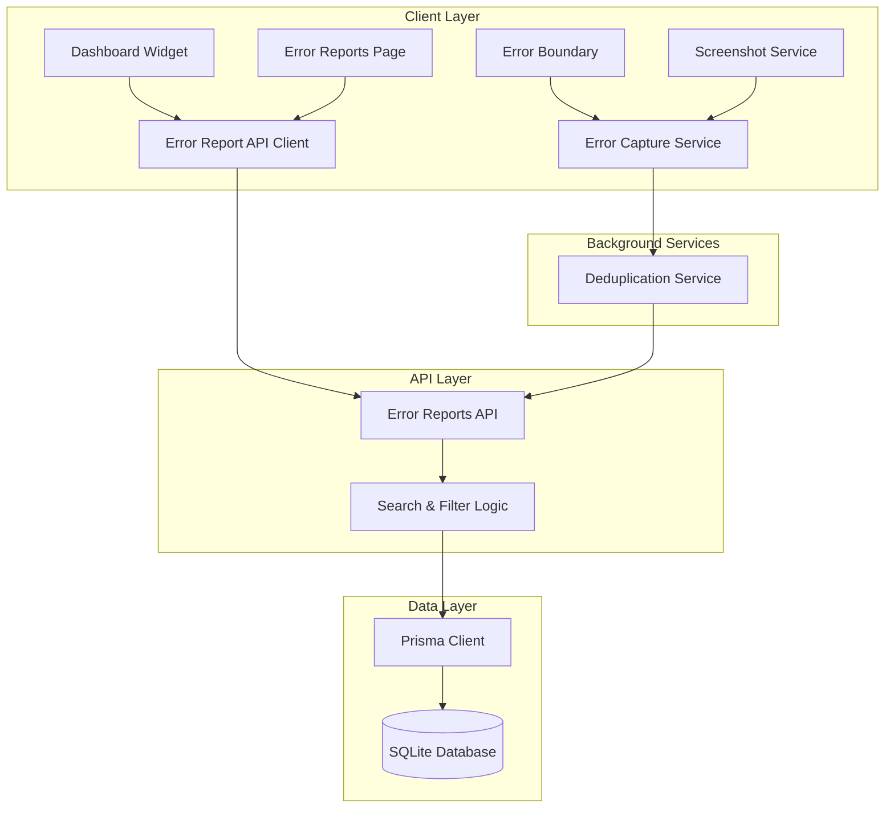
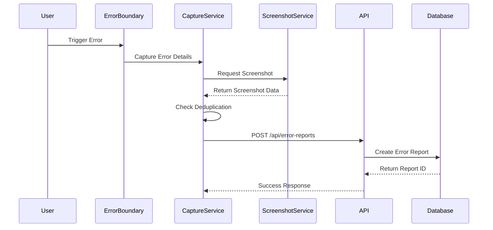

# Design Document

## Overview

This document outlines the technical design for enhancing the existing error reporting system with four key features: a dashboard widget, automatic error capture, search and filtering capabilities, and screenshot functionality. The design builds upon the existing ErrorReport model and API infrastructure while adding new components and services.

## Architecture

### High-Level Architecture



### Component Interaction Flow



## Components and Interfaces

### 1. Dashboard Widget Component

**Location**: `components/admin/ErrorReportWidget.tsx`

**Purpose**: Display error report statistics and recent errors on the admin dashboard

**Props Interface**:
```typescript
interface ErrorReportWidgetProps {
  refreshInterval?: number; // Default: 30000ms
  maxRecentErrors?: number; // Default: 5
}
```

**State Management**:
- Uses React hooks for local state
- Fetches data from `/api/admin/error-reports/stats`
- Auto-refreshes based on refreshInterval

**UI Structure**:
- Header with total count and unresolved count
- List of recent errors with:
  - Error type badge
  - Error title
  - Timestamp
  - Priority indicator
  - Click handler to navigate to detail view

### 2. Automatic Error Capture Service

**Location**: `lib/error-capture.ts`

**Purpose**: Automatically detect and report JavaScript errors, promise rejections, and API failures

**Core Functions**:

```typescript
interface ErrorCaptureConfig {
  enabled: boolean;
  deduplicationWindow: number; // milliseconds
  excludePatterns: RegExp[];
  maxStackTraceLength: number;
}

interface CapturedError {
  type: 'javascript' | 'promise' | 'api';
  message: string;
  stack?: string;
  url: string;
  timestamp: number;
  context: Record<string, any>;
}

class ErrorCaptureService {
  initialize(config: ErrorCaptureConfig): void;
  captureError(error: Error, context?: Record<string, any>): Promise<void>;
  captureApiError(response: Response, request: Request): Promise<void>;
  private shouldCapture(error: CapturedError): boolean;
  private deduplicateError(error: CapturedError): boolean;
  private sendErrorReport(error: CapturedError): Promise<void>;
}
```

**Implementation Details**:
- Registers global error handlers:
  - `window.onerror` for JavaScript errors
  - `window.onunhandledrejection` for promise rejections
  - Axios/Fetch interceptors for API errors
- Maintains in-memory cache of recent errors for deduplication
- Uses localStorage to persist error hashes across page reloads
- Automatically captures screenshot when error occurs

**Deduplication Strategy**:
- Generate error hash from: error message + stack trace (first 3 lines) + page URL
- Store hash with timestamp in memory
- If same hash appears within 60 seconds, increment counter instead of creating new report
- Send aggregated report after deduplication window expires

### 3. Search and Filtering System

**Location**: `components/admin/ErrorReportsTable.tsx` (enhanced)

**API Endpoint**: `GET /api/admin/error-reports`

**Query Parameters**:
```typescript
interface ErrorReportFilters {
  search?: string;           // Full-text search
  status?: string[];         // PENDING, IN_PROGRESS, RESOLVED, CLOSED
  priority?: string[];       // LOW, MEDIUM, HIGH, CRITICAL
  errorType?: string[];      // UI_ERROR, API_ERROR, etc.
  dateFrom?: string;         // ISO date string
  dateTo?: string;          // ISO date string
  userId?: string;          // Filter by specific user
  page?: number;
  limit?: number;
  sortBy?: string;          // createdAt, priority, status
  sortOrder?: 'asc' | 'desc';
}
```

**Backend Implementation**:
- Uses Prisma's filtering capabilities
- Implements full-text search across errorMessage, errorTitle, and stackTrace
- Combines multiple filters with AND logic
- Returns paginated results with total count

**Frontend Components**:
- Search input with debounce (300ms)
- Multi-select dropdowns for status, priority, and error type
- Date range picker
- Clear filters button
- Active filter badges
- Results count display

### 4. Screenshot Feature

**Location**: `lib/screenshot-capture.ts`

**Purpose**: Capture browser viewport when errors occur

**Core Functions**:

```typescript
interface ScreenshotOptions {
  quality: number;        // 0.1 to 1.0
  maxSize: number;        // bytes
  format: 'image/jpeg' | 'image/png';
  width?: number;
  height?: number;
}

interface ScreenshotResult {
  success: boolean;
  data?: string;          // Base64 encoded image
  error?: string;
  size: number;           // bytes
  dimensions: { width: number; height: number };
}

class ScreenshotService {
  async captureViewport(options?: ScreenshotOptions): Promise<ScreenshotResult>;
  private async compressImage(dataUrl: string, targetSize: number): Promise<string>;
  private async resizeCanvas(canvas: HTMLCanvasElement, maxWidth: number): Promise<HTMLCanvasElement>;
}
```

**Implementation Strategy**:
- Uses `html2canvas` library for viewport capture
- Default quality: 0.7 (JPEG)
- Max size: 2MB
- Compression algorithm:
  1. Capture at full quality
  2. If size > maxSize, reduce quality by 0.1
  3. Repeat until size < maxSize or quality < 0.3
  4. If still too large, reduce dimensions by 20%
  5. If still too large after 3 resize attempts, skip screenshot

**Error Handling**:
- Gracefully handle browser permission errors
- Handle canvas tainting from cross-origin images
- Log failures but don't block error report submission
- Return null screenshot data on failure

**Storage**:
- Store as base64 string in database (screenshot column)
- Consider future migration to cloud storage (S3, Cloudinary) if size becomes issue

## Data Models

### Existing ErrorReport Model (No Changes Required)

The existing Prisma schema already supports all required fields:

```prisma
model ErrorReport {
  id          String   @id @default(cuid())
  userId      String?
  user        User?    @relation(fields: [userId], references: [id])
  userEmail   String?
  errorType   String
  errorTitle  String
  errorMessage String
  stackTrace  String?
  pageUrl     String
  userAgent   String?
  screenshot  String?  // Base64 encoded screenshot
  status      String   @default("PENDING")
  priority    String   @default("MEDIUM")
  assignedTo  String?
  resolvedBy  String?
  resolvedAt  DateTime?
  resolution  String?
  createdAt   DateTime @default(now())
  updatedAt   DateTime @updatedAt
  
  @@index([userId])
  @@index([status])
  @@index([priority])
  @@index([errorType])
  @@index([createdAt])
}
```

### New API Response Types

```typescript
// Dashboard widget stats
interface ErrorReportStats {
  total24h: number;
  unresolved: number;
  byPriority: {
    critical: number;
    high: number;
    medium: number;
    low: number;
  };
  byType: Record<string, number>;
  recentErrors: Array<{
    id: string;
    errorType: string;
    errorTitle: string;
    priority: string;
    createdAt: string;
  }>;
}

// Search results
interface ErrorReportSearchResult {
  errorReports: ErrorReport[];
  pagination: {
    page: number;
    limit: number;
    total: number;
    totalPages: number;
  };
  filters: {
    applied: ErrorReportFilters;
    available: {
      statuses: string[];
      priorities: string[];
      errorTypes: string[];
    };
  };
}
```

## Error Handling

### Client-Side Error Handling

1. **Error Boundary Component**:
   - Wrap application in React Error Boundary
   - Catch rendering errors
   - Display fallback UI
   - Automatically report error to backend

2. **Global Error Handlers**:
   - Register on app initialization
   - Prevent duplicate error reports
   - Handle errors during error reporting (fail silently)

3. **API Error Handling**:
   - Intercept failed API calls
   - Only report 500-level errors
   - Include request/response details
   - Exclude authentication errors (401, 403)

### Backend Error Handling

1. **API Validation**:
   - Validate all required fields
   - Sanitize user input
   - Limit screenshot size
   - Rate limit error report submissions (max 10 per minute per user)

2. **Database Errors**:
   - Handle unique constraint violations
   - Retry on transient failures
   - Log database errors separately

3. **Email Notification Failures**:
   - Don't block error report creation
   - Log email failures
   - Retry with exponential backoff

## Testing Strategy

### Unit Tests

1. **Error Capture Service**:
   - Test deduplication logic
   - Test error hash generation
   - Test filtering of excluded patterns
   - Mock window.onerror and window.onunhandledrejection

2. **Screenshot Service**:
   - Test compression algorithm
   - Test size limit enforcement
   - Test error handling for canvas tainting
   - Mock html2canvas library

3. **Search and Filter Logic**:
   - Test query building
   - Test filter combinations
   - Test pagination
   - Test sorting

### Integration Tests

1. **Dashboard Widget**:
   - Test data fetching
   - Test auto-refresh
   - Test navigation to detail view
   - Test loading and error states

2. **Error Report API**:
   - Test POST endpoint with various error types
   - Test GET endpoint with different filter combinations
   - Test authentication and authorization
   - Test rate limiting

3. **End-to-End Error Flow**:
   - Trigger JavaScript error
   - Verify error captured
   - Verify screenshot attached
   - Verify error appears in dashboard widget
   - Verify error searchable in admin panel

### Manual Testing

1. **Browser Compatibility**:
   - Test error capture in Chrome, Firefox, Safari, Edge
   - Test screenshot capture in different browsers
   - Test with browser extensions that might interfere

2. **Performance Testing**:
   - Test with high error volume
   - Test deduplication under load
   - Test dashboard widget with large datasets
   - Measure screenshot capture time

3. **Accessibility Testing**:
   - Test dashboard widget with screen readers
   - Test keyboard navigation in error reports table
   - Test filter controls accessibility
   - Verify ARIA labels and roles

## Performance Considerations

### Client-Side Performance

1. **Error Capture**:
   - Debounce error handler to prevent flooding
   - Use Web Workers for screenshot processing (future enhancement)
   - Lazy load html2canvas library
   - Limit stack trace length to 5000 characters

2. **Dashboard Widget**:
   - Implement virtual scrolling for large error lists
   - Cache API responses for 30 seconds
   - Use React.memo for list items
   - Implement skeleton loading states

### Backend Performance

1. **Database Queries**:
   - Use existing indexes on status, priority, errorType, createdAt
   - Implement cursor-based pagination for large datasets
   - Add composite index for common filter combinations
   - Use database-level full-text search (future enhancement)

2. **API Response Time**:
   - Target: < 200ms for stats endpoint
   - Target: < 500ms for search endpoint
   - Implement response caching with Redis (future enhancement)
   - Use database connection pooling

## Security Considerations

1. **Data Sanitization**:
   - Sanitize all user input before storing
   - Strip sensitive data from stack traces (tokens, passwords)
   - Limit screenshot size to prevent DoS
   - Validate base64 image data

2. **Access Control**:
   - Only admins can view error reports
   - Users can only view their own error reports
   - Implement rate limiting on error report submission
   - Log all access to error reports for audit

3. **Privacy**:
   - Anonymize user data in screenshots (blur sensitive areas - future enhancement)
   - Don't capture screenshots on sensitive pages (payment, settings)
   - Allow users to opt-out of automatic error reporting
   - Implement data retention policy (delete old error reports after 90 days)

## Deployment Considerations

1. **Feature Flags**:
   - Implement feature flag for automatic error capture
   - Allow disabling screenshot capture per environment
   - Enable gradual rollout to users

2. **Monitoring**:
   - Monitor error report submission rate
   - Alert on sudden spikes in error reports
   - Track screenshot capture success rate
   - Monitor API response times

3. **Database Migration**:
   - No schema changes required
   - Add composite indexes in production
   - Monitor database size growth

4. **Rollback Plan**:
   - Feature can be disabled via feature flag
   - No database migrations to rollback
   - Remove global error handlers on disable

## Future Enhancements

1. **Advanced Features**:
   - Error grouping by similarity
   - Automatic error assignment based on error type
   - Integration with external error tracking services (Sentry, Rollbar)
   - Machine learning for error priority prediction

2. **Performance Improvements**:
   - Move screenshots to cloud storage
   - Implement full-text search with Elasticsearch
   - Add caching layer with Redis
   - Use Web Workers for screenshot processing

3. **User Experience**:
   - Add error report templates
   - Implement collaborative error resolution
   - Add comments and discussion threads
   - Email notifications for error status changes
