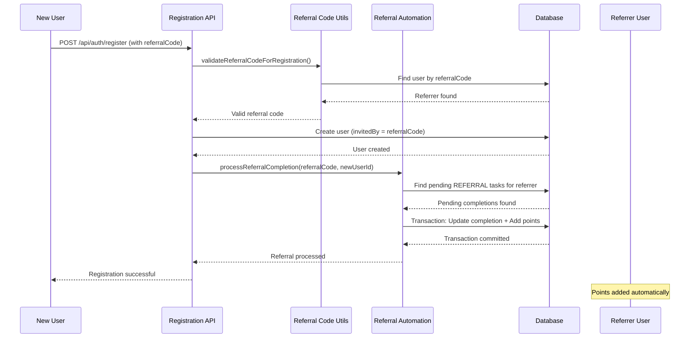

# Referral Task Automation - Design Document

## Overview

The Referral Task Automation system extends the existing task completion framework to automatically reward users when their invited friends successfully register. This design integrates seamlessly with the current referral code system, task completion workflow, and points mechanism.

### Key Design Principles

1. **Non-Blocking**: Referral processing must not block user registration
2. **Transactional**: All referral completions must be atomic and consistent
3. **Backward Compatible**: Existing referral code system remains unchanged
4. **Fail-Safe**: Registration succeeds even if referral processing fails
5. **Auditable**: All referral completions are logged for tracking

## Architecture

### System Components

```
┌─────────────────────────────────────────────────────────────┐
│                    Registration Flow                         │
└─────────────────────────────────────────────────────────────┘
                              │
                              ▼
┌─────────────────────────────────────────────────────────────┐
│  1. Validate Referral Code (existing)                       │
│     - lib/referral-code.ts                                  │
│     - validateReferralCodeForRegistration()                 │
└─────────────────────────────────────────────────────────────┘
                              │
                              ▼
┌─────────────────────────────────────────────────────────────┐
│  2. Create User with invitedBy field                        │
│     - app/api/auth/register/route.ts                        │
│     - Prisma transaction                                    │
└─────────────────────────────────────────────────────────────┘
                              │
                              ▼
┌─────────────────────────────────────────────────────────────┐
│  3. Process Referral Task Completion (NEW)                  │
│     - lib/referral-automation.ts                            │
│     - processReferralCompletion()                           │
└─────────────────────────────────────────────────────────────┘
                              │
                              ▼
┌─────────────────────────────────────────────────────────────┐
│  4. Update Referrer's Points & Task Status                  │
│     - Prisma transaction                                    │
│     - PENDING → APPROVED                                    │
└─────────────────────────────────────────────────────────────┘
```

### Data Flow



## Components and Interfaces

### 1. Task Type Extension

**File**: `types/index.ts`

```typescript
// Add REFERRAL to TaskType union
export type TaskType = 
  | 'TWITTER_FOLLOW' 
  | 'TWITTER_LIKE' 
  | 'TWITTER_RETWEET' 
  | 'TELEGRAM_JOIN' 
  | 'REFERRAL'  // NEW
  | 'CUSTOM'
```

### 2. Referral Automation Module

**File**: `lib/referral-automation.ts` (NEW)

```typescript
/**
 * Referral Task Automation
 * 
 * Automatically completes referral tasks when users successfully
 * invite friends to register using their referral codes.
 */

import { prisma, executeTransaction } from './prisma';

export interface ReferralCompletionResult {
  success: boolean;
  completionId?: string;
  pointsAwarded?: number;
  error?: string;
}

/**
 * Process referral task completion for a successful registration
 * 
 * @param referralCode - The referral code used during registration
 * @param newUserId - The ID of the newly registered user
 * @returns Result of the referral processing
 */
export async function processReferralCompletion(
  referralCode: string,
  newUserId: string
): Promise<ReferralCompletionResult>

/**
 * Find pending referral task completions for a user
 * 
 * @param userId - The referrer's user ID
 * @returns Array of pending referral completions
 */
async function findPendingReferralCompletions(userId: string)

/**
 * Complete a referral task and award points
 * 
 * @param completionId - The completion record to approve
 * @param taskPoints - Points to award
 * @param userId - The referrer's user ID
 * @param refereeId - The new user's ID (for audit)
 */
async function completeReferralTask(
  completionId: string,
  taskPoints: number,
  userId: string,
  refereeId: string
)
```

### 3. Admin Task Form Enhancement

**File**: `components/admin/TaskForm.tsx`

Add REFERRAL option to task type dropdown:

```typescript
const taskTypes = [
  { value: 'TWITTER_FOLLOW', label: 'Twitter Follow' },
  { value: 'TWITTER_LIKE', label: 'Twitter Like' },
  { value: 'TWITTER_RETWEET', label: 'Twitter Retweet' },
  { value: 'TELEGRAM_JOIN', label: 'Telegram Join' },
  { value: 'REFERRAL', label: 'Referral Task' }, // NEW
  { value: 'CUSTOM', label: 'Custom' },
];
```

### 4. Registration API Integration

**File**: `app/api/auth/register/route.ts`

Integrate referral automation after user creation:

```typescript
// After user is created successfully
if (invitedByCode) {
  try {
    const { processReferralCompletion } = await import('@/lib/referral-automation');
    await processReferralCompletion(invitedByCode, user.id);
  } catch (referralError) {
    // Log error but don't fail registration
    console.error('Referral task completion failed:', referralError);
  }
}
```

### 5. Task Completion API Enhancement

**File**: `app/api/completions/route.ts`

Add special handling for REFERRAL task type:

```typescript
// After task validation
if (task.taskType === 'REFERRAL') {
  // Create PENDING completion
  // User must wait for friend to register
  // Status will be updated by referral automation
}
```

## Data Models

### Existing Models (No Changes Required)

The current Prisma schema already supports all required fields:

```prisma
model User {
  referralCode String? @unique  // User's own referral code
  invitedBy    String?          // Referral code of inviter
  totalPoints  Int @default(0)  // Points balance
}

model Task {
  taskType String  // Will include "REFERRAL"
  points   Int     // Points to award
}

model Completion {
  status        String @default("PENDING")  // PENDING, APPROVED, REJECTED
  pointsAwarded Int @default(0)             // Points awarded
  completedAt   DateTime @default(now())    // Completion timestamp
}
```

### Database Indexes

Existing indexes are sufficient:
- `User.referralCode` - Already indexed
- `User.invitedBy` - Already indexed
- `Completion.userId` - Already indexed
- `Completion.status` - Already indexed

## Error Handling

### Error Scenarios and Responses

| Scenario | Handling | User Impact |
|----------|----------|-------------|
| Invalid referral code | Skip referral processing | Registration succeeds |
| Referrer not found | Skip referral processing | Registration succeeds |
| No pending referral tasks | Skip referral processing | Registration succeeds |
| Database transaction fails | Log error, rollback | Registration succeeds |
| Multiple pending tasks | Complete oldest first | One task completed |
| Concurrent registrations | Use database locks | All processed safely |

### Error Logging

```typescript
// Log structure for referral errors
{
  timestamp: Date,
  event: 'referral_completion_error',
  referralCode: string,
  newUserId: string,
  error: string,
  stack: string
}
```

## Testing Strategy

### Unit Tests

**File**: `__tests__/referral-automation.test.ts`

1. **Test: Generate unique referral code**
   - Verify code format (6-12 chars, alphanumeric)
   - Verify uniqueness check

2. **Test: Validate referral code**
   - Valid code format
   - Invalid code format
   - Non-existent code

3. **Test: Find pending referral completions**
   - User with pending tasks
   - User with no pending tasks
   - User with multiple pending tasks

4. **Test: Complete referral task**
   - Update completion status
   - Award points correctly
   - Update timestamps

5. **Test: Process referral completion**
   - Successful completion
   - No pending tasks
   - Invalid referral code
   - Database error handling

### Integration Tests

**File**: `__tests__/referral-integration.test.ts`

1. **Test: End-to-end referral flow**
   - User A creates account (gets referral code)
   - User A claims referral task (status: PENDING)
   - User B registers with User A's code
   - Verify User A's task is APPROVED
   - Verify User A's points increased

2. **Test: Multiple referrals**
   - User claims multiple referral tasks
   - Multiple users register with same code
   - Verify tasks completed in order

3. **Test: Registration without referral**
   - User registers without code
   - Verify no errors
   - Verify registration succeeds

4. **Test: Invalid referral code**
   - User registers with invalid code
   - Verify registration succeeds
   - Verify no task completion

### Manual Testing Checklist

1. **Admin Task Creation**
   - [ ] Create REFERRAL task type
   - [ ] Set point value
   - [ ] Verify task appears in task list

2. **User Task Claiming**
   - [ ] User claims referral task
   - [ ] Verify status is PENDING
   - [ ] Verify referral code is displayed

3. **Referral Registration**
   - [ ] New user registers with referral code
   - [ ] Verify registration succeeds
   - [ ] Verify referrer's task is APPROVED
   - [ ] Verify referrer's points increased

4. **Edge Cases**
   - [ ] Register without referral code
   - [ ] Register with invalid code
   - [ ] Multiple referrals for same user
   - [ ] Referral task not claimed

## Performance Considerations

### Database Queries

1. **Find Referrer by Code**: O(1) with unique index
   ```sql
   SELECT id FROM User WHERE referralCode = ?
   ```

2. **Find Pending Completions**: O(log n) with composite index
   ```sql
   SELECT * FROM Completion 
   WHERE userId = ? AND status = 'PENDING'
   ORDER BY completedAt ASC
   LIMIT 1
   ```

3. **Update Completion + Points**: Single transaction
   ```sql
   BEGIN TRANSACTION;
   UPDATE Completion SET status = 'APPROVED', pointsAwarded = ? WHERE id = ?;
   UPDATE User SET totalPoints = totalPoints + ? WHERE id = ?;
   COMMIT;
   ```

### Expected Performance

- **Referral Processing Time**: < 100ms
- **Database Queries**: 3 queries per referral
- **Transaction Overhead**: Minimal (single transaction)
- **Concurrent Safety**: Handled by database locks

### Optimization Strategies

1. **Batch Processing**: Not needed (real-time is acceptable)
2. **Caching**: Not needed (infrequent operation)
3. **Async Processing**: Optional (can be added later if needed)
4. **Rate Limiting**: Existing registration rate limits apply

## Security Considerations

### Fraud Prevention

1. **Referral Code Validation**
   - Format validation (6-12 chars, alphanumeric)
   - Existence check in database
   - Case-insensitive matching

2. **Self-Referral Prevention**
   - Cannot use own referral code
   - Checked during registration

3. **Duplicate Prevention**
   - One referral per registration
   - Tracked via `invitedBy` field
   - Cannot change after registration

4. **Task Completion Limits**
   - One task completed per referral
   - Oldest pending task completed first
   - No retroactive completions

### Audit Trail

All referral completions are logged:
- Referee user ID
- Referrer user ID
- Completion timestamp
- Points awarded
- Task ID

## Deployment Considerations

### Database Migrations

No schema changes required. Existing schema supports all features.

### Configuration

No new environment variables required.

### Rollback Plan

If issues arise:
1. Disable REFERRAL task type in admin panel
2. Existing completions remain unchanged
3. No data loss or corruption

### Monitoring

Track these metrics:
- Referral task completions per day
- Average points awarded per referral
- Failed referral processing attempts
- Registration conversion rate with referrals

## Future Enhancements

### Phase 2 Features (Optional)

1. **Referral Tiers**
   - Bronze: 1-5 referrals
   - Silver: 6-20 referrals
   - Gold: 21+ referrals
   - Different point rewards per tier

2. **Referral Leaderboard**
   - Top referrers by count
   - Top referrers by points earned
   - Monthly/weekly rankings

3. **Referral Analytics**
   - Conversion rates
   - Geographic distribution
   - Time-to-conversion metrics

4. **Bonus Rewards**
   - Milestone bonuses (10th, 50th, 100th referral)
   - Limited-time referral campaigns
   - Referral contests

5. **Social Sharing**
   - Pre-built social media posts
   - Referral link shortening
   - QR code generation

## Dependencies

### Existing Systems

- ✅ Referral code system (`lib/referral-code.ts`)
- ✅ Task completion system (`app/api/completions/route.ts`)
- ✅ Points system (User.totalPoints)
- ✅ Registration API (`app/api/auth/register/route.ts`)

### New Dependencies

- None (uses existing libraries and frameworks)

### External Services

- None (all processing is internal)

## Internationalization

### Translation Keys

Add to `locales/{lang}/tasks.json`:

```json
{
  "referral": {
    "title": "Refer a Friend",
    "description": "Invite friends to earn rewards",
    "pending": "Waiting for friend to register",
    "completed": "Friend registered successfully",
    "shareCode": "Share your code",
    "copyCode": "Copy referral code",
    "shareLink": "Share referral link"
  }
}
```

### Supported Languages

- English (en)
- Turkish (tr)
- German (de)
- Chinese (zh)
- Russian (ru)

## Success Metrics

### Key Performance Indicators

1. **Adoption Rate**: % of users who claim referral tasks
2. **Completion Rate**: % of claimed tasks that complete
3. **Conversion Rate**: % of referrals that register
4. **Average Referrals**: Mean referrals per active user
5. **Points Distribution**: Total points awarded via referrals

### Success Criteria

- ✅ 95%+ successful referral processing
- ✅ < 100ms average processing time
- ✅ Zero registration failures due to referral errors
- ✅ 100% audit trail coverage
- ✅ Positive user feedback on referral experience
