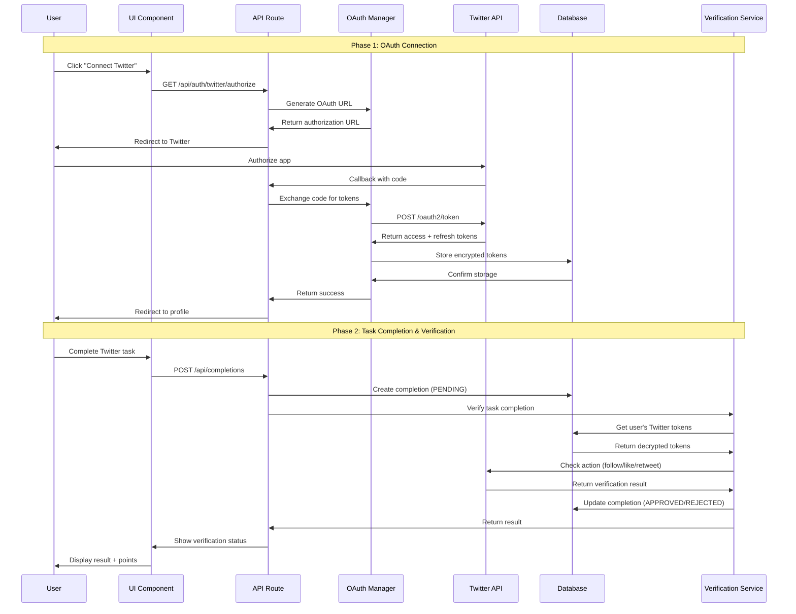

# Twitter Task Automation - Design Document

## Overview

This document describes the technical design for implementing automatic Twitter task verification using OAuth 2.0 authentication and Twitter API v2. The system will verify follow, like, and retweet actions without manual intervention.

## Architecture

### High-Level Architecture

```
┌─────────────────────────────────────────────────────────────────┐
│                         User Interface                           │
│  ┌──────────────┐  ┌──────────────┐  ┌──────────────┐          │
│  │ Profile Page │  │  Task Modal  │  │  Task List   │          │
│  │ (Connect)    │  │  (Verify)    │  │  (Status)    │          │
│  └──────────────┘  └──────────────┘  └──────────────┘          │
└─────────────────────────────────────────────────────────────────┘
                              │
                              ▼
┌─────────────────────────────────────────────────────────────────┐
│                      API Layer (Next.js)                         │
│  ┌──────────────┐  ┌──────────────┐  ┌──────────────┐          │
│  │ OAuth Routes │  │ Verify Route │  │ Status Route │          │
│  │ /auth/twitter│  │ /completions │  │ /twitter/    │          │
│  └──────────────┘  └──────────────┘  └──────────────┘          │
└─────────────────────────────────────────────────────────────────┘
                              │
                              ▼
┌─────────────────────────────────────────────────────────────────┐
│                    Business Logic Layer                          │
│  ┌──────────────┐  ┌──────────────┐  ┌──────────────┐          │
│  │ OAuth Manager│  │ Verification │  │ Token Manager│          │
│  │              │  │ Service      │  │              │          │
│  └──────────────┘  └──────────────┘  └──────────────┘          │
└─────────────────────────────────────────────────────────────────┘
                              │
                              ▼
┌─────────────────────────────────────────────────────────────────┐
│                    External Services                             │
│  ┌──────────────┐  ┌──────────────┐  ┌──────────────┐          │
│  │ Twitter API  │  │  Database    │  │ Encryption   │          │
│  │  (OAuth 2.0) │  │  (Prisma)    │  │  Service     │          │
│  └──────────────┘  └──────────────┘  └──────────────┘          │
└─────────────────────────────────────────────────────────────────┘
```

### Component Interaction Flow



## Data Models

### Database Schema Changes

#### New Model: TwitterConnection

```prisma
model TwitterConnection {
  id                String    @id @default(cuid())
  userId            String    @unique
  twitterId         String    @unique  // Twitter user ID
  username          String              // Twitter username
  displayName       String?             // Twitter display name
  profileImageUrl   String?
  
  // Encrypted tokens
  accessToken       String              // AES-256 encrypted
  refreshToken      String              // AES-256 encrypted
  tokenExpiresAt    DateTime
  
  // OAuth metadata
  scope             String              // Granted permissions
  tokenType         String              // "Bearer"
  
  // Status
  isActive          Boolean   @default(true)
  lastVerifiedAt    DateTime?
  
  // Timestamps
  connectedAt       DateTime  @default(now())
  updatedAt         DateTime  @updatedAt
  
  // Relations
  user              User      @relation(fields: [userId], references: [id], onDelete: Cascade)
  
  @@index([userId])
  @@index([twitterId])
  @@index([isActive])
}
```

#### Updated Model: User

```prisma
model User {
  // ... existing fields ...
  
  // Twitter connection (new relation)
  twitterConnection TwitterConnection?
  
  // Keep existing fields for backward compatibility
  twitterUsername   String?   @unique
  twitterVerified   Boolean   @default(false)
}
```

#### New Model: TwitterVerificationLog

```prisma
model TwitterVerificationLog {
  id              String    @id @default(cuid())
  completionId    String
  userId          String
  taskId          String
  taskType        String    // TWITTER_FOLLOW, TWITTER_LIKE, TWITTER_RETWEET
  
  // Verification details
  verificationResult String  // APPROVED, REJECTED, ERROR
  twitterApiResponse String? // JSON response from Twitter
  errorMessage       String?
  
  // Performance metrics
  verificationTime   Int     // Milliseconds
  apiCallCount       Int     // Number of API calls made
  
  // Timestamps
  verifiedAt      DateTime  @default(now())
  
  // Relations
  completion      Completion @relation(fields: [completionId], references: [id], onDelete: Cascade)
  user            User       @relation(fields: [userId], references: [id], onDelete: Cascade)
  task            Task       @relation(fields: [taskId], references: [id], onDelete: Cascade)
  
  @@index([completionId])
  @@index([userId])
  @@index([taskId])
  @@index([verifiedAt])
}
```

## API Endpoints

### OAuth Endpoints

#### 1. Initiate Twitter OAuth

```typescript
GET /api/auth/twitter/authorize

Response:
{
  "authorizationUrl": "https://twitter.com/i/oauth2/authorize?...",
  "state": "random_csrf_token"
}
```

#### 2. OAuth Callback

```typescript
GET /api/auth/twitter/callback?code=xxx&state=xxx

Response:
{
  "success": true,
  "user": {
    "twitterId": "123456789",
    "username": "johndoe",
    "displayName": "John Doe"
  }
}
```

#### 3. Disconnect Twitter

```typescript
DELETE /api/auth/twitter/disconnect

Response:
{
  "success": true,
  "message": "Twitter account disconnected"
}
```

#### 4. Get Twitter Connection Status

```typescript
GET /api/auth/twitter/status

Response:
{
  "connected": true,
  "username": "johndoe",
  "connectedAt": "2025-11-13T10:00:00Z",
  "lastVerifiedAt": "2025-11-13T12:30:00Z"
}
```

### Verification Endpoints

#### 1. Verify Task Completion

```typescript
POST /api/twitter/verify

Request:
{
  "completionId": "comp_123",
  "taskId": "task_456",
  "taskType": "TWITTER_FOLLOW" | "TWITTER_LIKE" | "TWITTER_RETWEET"
}

Response:
{
  "success": true,
  "verified": true,
  "result": "APPROVED" | "REJECTED",
  "reason": "User follows @username" | "User has not liked the tweet",
  "pointsAwarded": 100,
  "verificationTime": 1234 // milliseconds
}
```

#### 2. Batch Verify (for admin)

```typescript
POST /api/twitter/verify/batch

Request:
{
  "completionIds": ["comp_123", "comp_456", "comp_789"]
}

Response:
{
  "success": true,
  "results": [
    { "completionId": "comp_123", "verified": true, "result": "APPROVED" },
    { "completionId": "comp_456", "verified": false, "result": "REJECTED" },
    { "completionId": "comp_789", "verified": true, "result": "APPROVED" }
  ],
  "summary": {
    "total": 3,
    "approved": 2,
    "rejected": 1
  }
}
```

## Core Services

### 1. OAuth Manager (`lib/twitter/oauth-manager.ts`)

```typescript
interface TwitterOAuthManager {
  // Generate authorization URL
  getAuthorizationUrl(userId: string): Promise<{
    url: string;
    state: string;
  }>;
  
  // Handle OAuth callback
  handleCallback(code: string, state: string): Promise<{
    userId: string;
    twitterId: string;
    username: string;
  }>;
  
  // Refresh expired token
  refreshAccessToken(userId: string): Promise<string>;
  
  // Disconnect account
  disconnect(userId: string): Promise<void>;
  
  // Get valid access token (auto-refresh if needed)
  getValidAccessToken(userId: string): Promise<string>;
}
```

**Key Features:**
- PKCE (Proof Key for Code Exchange) for security
- CSRF protection with state parameter
- Automatic token refresh
- Token encryption/decryption

### 2. Verification Service (`lib/twitter/verification-service.ts`)

```typescript
interface TwitterVerificationService {
  // Verify follow action
  verifyFollow(
    userId: string,
    targetUsername: string
  ): Promise<VerificationResult>;
  
  // Verify like action
  verifyLike(
    userId: string,
    tweetId: string
  ): Promise<VerificationResult>;
  
  // Verify retweet action
  verifyRetweet(
    userId: string,
    tweetId: string
  ): Promise<VerificationResult>;
  
  // Process completion verification
  verifyCompletion(
    completionId: string
  ): Promise<VerificationResult>;
}

interface VerificationResult {
  verified: boolean;
  result: 'APPROVED' | 'REJECTED' | 'ERROR';
  reason?: string;
  apiResponse?: any;
  verificationTime: number;
  apiCallCount: number;
}
```

**Key Features:**
- Automatic retry with exponential backoff
- Rate limit handling
- Response caching
- Performance monitoring

### 3. Token Manager (`lib/twitter/token-manager.ts`)

```typescript
interface TwitterTokenManager {
  // Encrypt token before storage
  encryptToken(token: string): string;
  
  // Decrypt token from storage
  decryptToken(encryptedToken: string): string;
  
  // Check if token is expired
  isTokenExpired(expiresAt: Date): boolean;
  
  // Store tokens securely
  storeTokens(
    userId: string,
    accessToken: string,
    refreshToken: string,
    expiresIn: number
  ): Promise<void>;
  
  // Get decrypted tokens
  getTokens(userId: string): Promise<{
    accessToken: string;
    refreshToken: string;
    expiresAt: Date;
  }>;
}
```

**Key Features:**
- AES-256-GCM encryption
- Secure key management
- Token rotation
- Audit logging

### 4. Twitter API Client (`lib/twitter/api-client.ts`)

```typescript
interface TwitterAPIClient {
  // Check if user follows target
  checkFollowing(
    accessToken: string,
    userId: string,
    targetUserId: string
  ): Promise<boolean>;
  
  // Check if user liked tweet
  checkLiked(
    accessToken: string,
    userId: string,
    tweetId: string
  ): Promise<boolean>;
  
  // Check if user retweeted
  checkRetweeted(
    accessToken: string,
    userId: string,
    tweetId: string
  ): Promise<boolean>;
  
  // Get user info
  getUserInfo(
    accessToken: string
  ): Promise<TwitterUserInfo>;
  
  // Lookup username to get user ID
  lookupUser(
    accessToken: string,
    username: string
  ): Promise<{ id: string; username: string }>;
}
```

**Twitter API v2 Endpoints Used:**
- `GET /2/users/:id/following` - Check following
- `GET /2/users/:id/liked_tweets` - Check likes
- `GET /2/users/:id/retweeted_by` - Check retweets
- `GET /2/users/me` - Get authenticated user info
- `GET /2/users/by/username/:username` - Lookup user by username

## Components and Interfaces

### 1. Twitter Connect Button (`components/twitter/TwitterConnectButton.tsx`)

```typescript
interface TwitterConnectButtonProps {
  onSuccess?: () => void;
  onError?: (error: string) => void;
  className?: string;
}

export function TwitterConnectButton({
  onSuccess,
  onError,
  className
}: TwitterConnectButtonProps) {
  // Handle OAuth flow
  // Show loading state
  // Display connection status
}
```

### 2. Twitter Verification Status (`components/twitter/TwitterVerificationStatus.tsx`)

```typescript
interface TwitterVerificationStatusProps {
  completionId: string;
  taskType: TaskType;
  status: 'PENDING' | 'VERIFYING' | 'APPROVED' | 'REJECTED';
  reason?: string;
}

export function TwitterVerificationStatus({
  completionId,
  taskType,
  status,
  reason
}: TwitterVerificationStatusProps) {
  // Show verification progress
  // Display result with icon
  // Show retry button if failed
}
```

### 3. Twitter Task Instructions (`components/twitter/TwitterTaskInstructions.tsx`)

```typescript
interface TwitterTaskInstructionsProps {
  taskType: 'TWITTER_FOLLOW' | 'TWITTER_LIKE' | 'TWITTER_RETWEET';
  taskUrl: string;
  isConnected: boolean;
}

export function TwitterTaskInstructions({
  taskType,
  taskUrl,
  isConnected
}: TwitterTaskInstructionsProps) {
  // Show step-by-step instructions
  // Display "Connect Twitter" if not connected
  // Show "Complete on Twitter" button
  // Display verification button
}
```

## Error Handling

### Error Types

```typescript
enum TwitterErrorType {
  // OAuth errors
  OAUTH_FAILED = 'OAUTH_FAILED',
  INVALID_STATE = 'INVALID_STATE',
  TOKEN_EXPIRED = 'TOKEN_EXPIRED',
  REFRESH_FAILED = 'REFRESH_FAILED',
  
  // API errors
  API_ERROR = 'API_ERROR',
  RATE_LIMIT = 'RATE_LIMIT',
  UNAUTHORIZED = 'UNAUTHORIZED',
  NOT_FOUND = 'NOT_FOUND',
  
  // Verification errors
  NOT_CONNECTED = 'NOT_CONNECTED',
  VERIFICATION_FAILED = 'VERIFICATION_FAILED',
  INVALID_TASK_URL = 'INVALID_TASK_URL',
  
  // System errors
  ENCRYPTION_ERROR = 'ENCRYPTION_ERROR',
  DATABASE_ERROR = 'DATABASE_ERROR',
  UNKNOWN_ERROR = 'UNKNOWN_ERROR'
}

interface TwitterError {
  type: TwitterErrorType;
  message: string;
  details?: any;
  retryable: boolean;
  userMessage: string; // User-friendly message
}
```

### Error Recovery Strategy

```typescript
// Retry configuration
const RETRY_CONFIG = {
  maxAttempts: 3,
  baseDelay: 1000, // 1 second
  maxDelay: 10000, // 10 seconds
  backoffMultiplier: 2
};

// Rate limit handling
const RATE_LIMIT_CONFIG = {
  queueEnabled: true,
  maxQueueSize: 100,
  retryAfterHeader: true
};
```

## Security Considerations

### 1. Token Security

```typescript
// Encryption configuration
const ENCRYPTION_CONFIG = {
  algorithm: 'aes-256-gcm',
  keyDerivation: 'pbkdf2',
  iterations: 100000,
  saltLength: 32,
  ivLength: 16,
  tagLength: 16
};

// Key management
const ENCRYPTION_KEY = process.env.TWITTER_TOKEN_ENCRYPTION_KEY;
// Must be 32 bytes (256 bits) for AES-256
```

### 2. OAuth Security

```typescript
// PKCE configuration
const PKCE_CONFIG = {
  codeVerifierLength: 128,
  codeChallengeMethod: 'S256' // SHA-256
};

// State parameter
const STATE_CONFIG = {
  length: 32,
  expirationMinutes: 10,
  storage: 'session' // Store in session for CSRF protection
};
```

### 3. API Security

```typescript
// Rate limiting per user
const USER_RATE_LIMIT = {
  windowMs: 15 * 60 * 1000, // 15 minutes
  maxRequests: 50 // 50 verifications per 15 minutes
};

// IP-based rate limiting
const IP_RATE_LIMIT = {
  windowMs: 15 * 60 * 1000,
  maxRequests: 100
};
```

## Performance Optimization

### 1. Caching Strategy

```typescript
// Cache configuration
const CACHE_CONFIG = {
  // Cache verification results
  verificationCache: {
    ttl: 60, // 60 seconds
    maxSize: 1000
  },
  
  // Cache user lookups
  userLookupCache: {
    ttl: 300, // 5 minutes
    maxSize: 500
  },
  
  // Cache Twitter API responses
  apiResponseCache: {
    ttl: 60,
    maxSize: 500
  }
};
```

### 2. Connection Pooling

```typescript
// Twitter API client pool
const API_CLIENT_POOL = {
  minConnections: 5,
  maxConnections: 20,
  idleTimeout: 30000, // 30 seconds
  connectionTimeout: 5000 // 5 seconds
};
```

### 3. Batch Processing

```typescript
// Batch verification configuration
const BATCH_CONFIG = {
  maxBatchSize: 10,
  batchTimeout: 5000, // 5 seconds
  concurrentBatches: 3
};
```

## Monitoring and Analytics

### 1. Metrics to Track

```typescript
interface TwitterMetrics {
  // OAuth metrics
  oauthAttempts: number;
  oauthSuccesses: number;
  oauthFailures: number;
  
  // Verification metrics
  verificationsTotal: number;
  verificationsApproved: number;
  verificationsRejected: number;
  verificationsError: number;
  averageVerificationTime: number;
  
  // API metrics
  apiCallsTotal: number;
  apiCallsSuccess: number;
  apiCallsFailure: number;
  apiRateLimitHits: number;
  
  // Performance metrics
  p50VerificationTime: number;
  p95VerificationTime: number;
  p99VerificationTime: number;
}
```

### 2. Logging Strategy

```typescript
// Log levels
enum LogLevel {
  DEBUG = 'debug',
  INFO = 'info',
  WARN = 'warn',
  ERROR = 'error'
}

// Structured logging
interface TwitterLog {
  timestamp: string;
  level: LogLevel;
  service: 'twitter-oauth' | 'twitter-verification';
  operation: string;
  userId?: string;
  completionId?: string;
  duration?: number;
  error?: TwitterError;
  metadata?: Record<string, any>;
}
```

## Testing Strategy

### 1. Unit Tests

- OAuth URL generation
- Token encryption/decryption
- API client methods
- Verification logic
- Error handling

### 2. Integration Tests

- OAuth flow end-to-end
- Verification with mocked Twitter API
- Token refresh flow
- Error recovery

### 3. E2E Tests

- Complete user journey
- Multiple task types
- Connection/disconnection
- Error scenarios

## Migration Strategy

### Phase 1: Database Migration

1. Add new tables (TwitterConnection, TwitterVerificationLog)
2. Add indexes
3. Migrate existing twitterUsername data (optional)

### Phase 2: Feature Flag

```typescript
const TWITTER_OAUTH_ENABLED = process.env.TWITTER_OAUTH_ENABLED === 'true';

// Gradual rollout
if (TWITTER_OAUTH_ENABLED) {
  // Use new OAuth verification
} else {
  // Use existing manual verification
}
```

### Phase 3: Gradual Rollout

1. Enable for admin users (testing)
2. Enable for 10% of users (beta)
3. Enable for 50% of users
4. Enable for all users
5. Remove feature flag

## Environment Variables

```bash
# Twitter OAuth credentials
TWITTER_CLIENT_ID=your_client_id
TWITTER_CLIENT_SECRET=your_client_secret
TWITTER_CALLBACK_URL=https://yourdomain.com/api/auth/twitter/callback

# Token encryption
TWITTER_TOKEN_ENCRYPTION_KEY=32_byte_random_key_here

# Feature flags
TWITTER_OAUTH_ENABLED=true
TWITTER_AUTO_VERIFY_ENABLED=true

# Rate limiting
TWITTER_API_RATE_LIMIT=15
TWITTER_API_RATE_WINDOW=900000

# Caching
TWITTER_CACHE_ENABLED=true
TWITTER_CACHE_TTL=60
```

## Dependencies

```json
{
  "dependencies": {
    "twitter-api-v2": "^1.15.0",
    "crypto": "built-in",
    "node-cache": "^5.1.2"
  },
  "devDependencies": {
    "@types/node-cache": "^4.2.5"
  }
}
```

## Success Criteria

1. ✅ 90%+ of Twitter tasks verified automatically
2. ✅ 95% of verifications complete within 5 seconds
3. ✅ Less than 5% error rate
4. ✅ Zero token leaks or security incidents
5. ✅ 99.9% uptime for verification service

---

**Document Version**: 1.0  
**Date**: November 13, 2025  
**Status**: Ready for Implementation Planning
